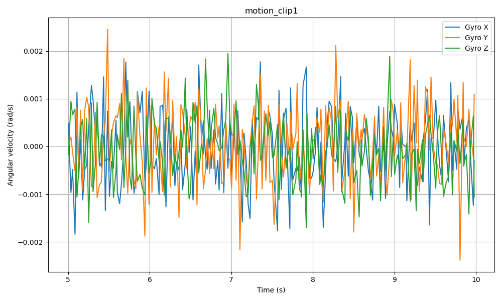
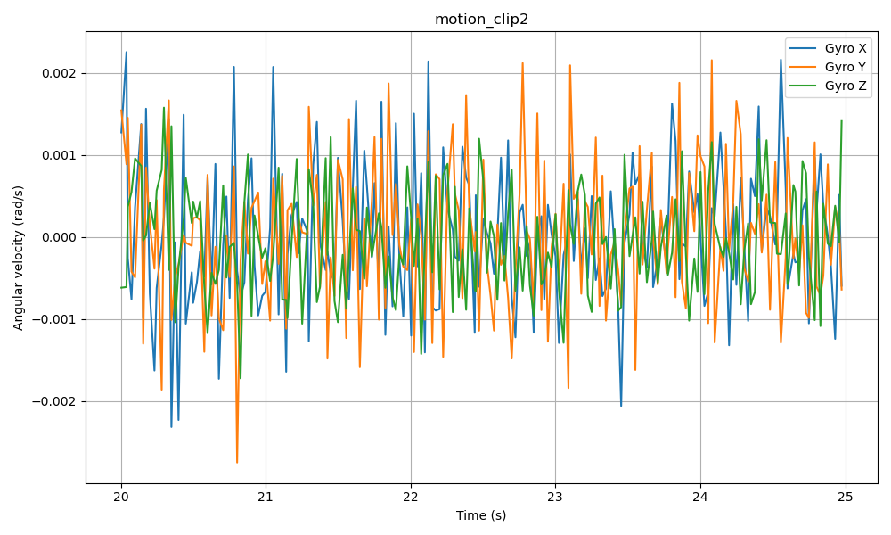
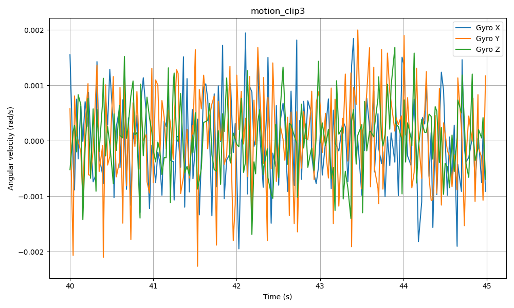

The final stationary dataset had the following properties:

Duration: 837.596 s

IMU messages: 162,547

Magnetic field messages: 162,547

This stationary dataset was used for time-series and histogram analysis. For Allan variance analysis, a long-duration stationary bag from the provided lab datasets was used.

4. Stationary Time-Series Analysis

Time-series plots were generated for the gyroscope, accelerometer, magnetometer, and orientation signals.

4.1 Gyroscope

The gyroscope plot shows small fluctuations around a nearly constant value, which is expected for a stationary IMU. These variations are due to sensor noise and bias drift.

4.2 Accelerometer

The accelerometer plot shows nearly constant acceleration values with small variations. Since the IMU was stationary, the dominant measured acceleration corresponds to gravity projected onto the sensor axes.

4.3 Magnetometer

The magnetometer plot shows relatively stable magnetic field values with small fluctuations caused by noise and local magnetic disturbances.

4.4 Orientation

Orientation was obtained from the quaternion output and converted to roll, pitch, and yaw. The orientation remained nearly constant over time, confirming that the sensor was stationary during the measurement.

4.5 Orientation Histogram

A histogram of roll, pitch, and yaw deviations from the median was generated to visualize the distribution of the orientation noise.

The computed mean and median values were:

Roll mean: 1.248600047986121 deg

Roll median: 1.2489999999999994 deg

Pitch mean: -37.29096917199333 deg

Pitch median: -37.28800000000001 deg

Yaw mean: -165.97253313195566 deg

Yaw median: -165.97 deg

The mean and median values are very close, indicating that the stationary orientation noise is centered around a stable operating point.

5. Allan Variance Analysis

Allan deviation analysis was performed on a long stationary IMU dataset using the overlapping Allan deviation method. Allan deviation is useful because it reveals how different noise processes dominate at different averaging times.

The following parameters were extracted from the Allan deviation curves:

N: random walk coefficient

B: bias instability

K: long-term random walk / drift coefficient

The minimum Allan deviation occurred at approximately 
  tau ~ 5591 s   

tau~5591 s for all axes, indicating the averaging time at which bias instability is most significant.

6. Gyroscope Allan Variance Results
Axis    N (at tau = 1 s)    B (minimum Allan deviation)    K (approximate)    tau at B (s)
X	0.03758412868306531	1.6331042185695566e-07	2.976368034526831e-09	5591.025
Y	0.0013373175584479471	2.4125925265328736e-08	3.226491263696451e-10	5591.225
Z	0.0011000052818457495	9.937589385517996e-08	2.197273280125293e-09	5591.2

The gyroscope Allan deviation curves show the expected decrease at short averaging times, followed by a minimum corresponding to bias instability. The X-axis gyroscope exhibited a noticeably larger random walk coefficient than the Y and Z axes.

7. Accelerometer Allan Variance Results
Axis    N (at tau = 1 s)    B (minimum Allan deviation)    K (approximate)    tau at B (s)
X	0.02493700965959006	1.019611467164295e-06	1.363581895819776e-08	5591.225
Y	0.022737134499068834	2.722388853793723e-06	4.094240558397894e-08	5591.15
Z	0.05389579175917558	4.046475657014202e-06	9.553311144931072e-08	5591.2

The accelerometer Allan deviation results show larger bias instability values than the gyroscope. The Z-axis accelerometer had the largest random walk coefficient, indicating higher short-term noise on that axis.

8. Discussion

The stationary time-series plots showed that the IMU outputs remained close to constant values with small fluctuations, which is consistent with a stationary measurement. The histograms around the median suggested that the noise is concentrated around a stable central value and approximately follows a narrow distribution.

The Allan deviation analysis showed distinct noise behavior across different averaging times. At short averaging times, white noise dominates and is reflected by the random walk coefficient 
N
N. At intermediate averaging times, the Allan deviation reaches a minimum, which corresponds to the bias instability B
B. At long averaging times, the increase in the Allan deviation is associated with long-term drift represented by 
K
K.

These noise parameters are important because they help quantify IMU quality and are directly useful in state-estimation methods such as Kalman filtering, sensor fusion, and inertial navigation.

9. Conclusion

In this lab, a ROS2 driver was developed for the VectorNav VN-100 IMU and used to publish IMU and magnetometer data. Stationary IMU data was recorded and analyzed through time-series plots, histograms, and Allan variance. The Allan deviation analysis produced quantitative noise parameters for both the gyroscope and accelerometer. These results provide a practical understanding of IMU noise behavior and show how Allan variance can be used to evaluate sensor performance for robotics applications.
## 10. Motion Experiment and Video Alignment

Three 5-second clips of IMU data were extracted to illustrate motion behavior over short time windows.

### Motion Clip 1

### Motion Clip 2

### Motion Clip 3

These clips show how angular velocity changes over short intervals and provide a visual example of how IMU data can be segmented for motion interpretation. In the full lab workflow, these clips should be aligned with the team’s recorded video to identify which physical motion corresponds to each spike or oscillation in the IMU measurements.
